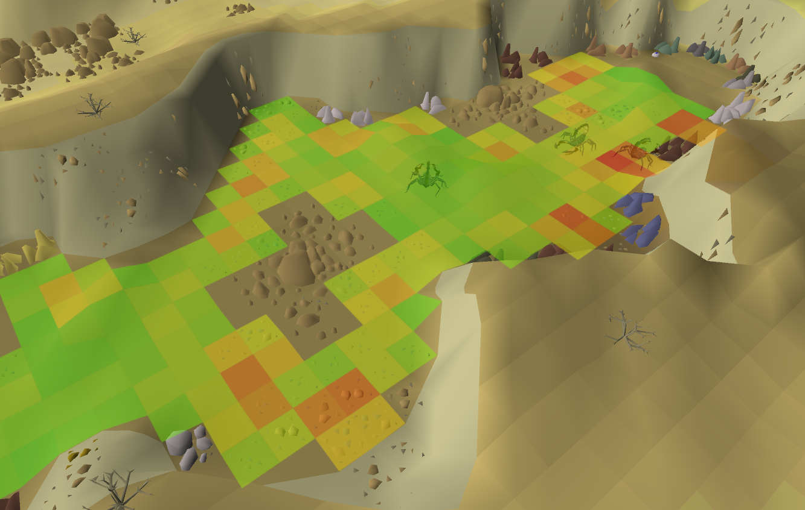

# NPC Heatmap

A RuneLite plugin that tracks where NPCs stand over time and displays a colour-coded heatmap of their most frequent tiles.

This should be helpful for identifying where to place a canon or to AFK.

## Setup

Open the plugin configuration and enter one or more NPC names in the **NPC Names** field, separated by commas.

Names are case-insensitive. Wildcards are supported using `*`:

- `Cow` — matches only NPCs named exactly "Cow"
- `Tz*` — matches any NPC whose name starts with "Tz" (e.g. TzTok-Jad, TzKal-Zuk)
- `*bat*` — matches any NPC whose name contains "bat"

Heatmap data persists across sessions and plugin restarts. Removing an NPC name from the config will delete its accumulated data.

## Removing tiles

Hold **Shift** and right-click any heatmap tile to reveal a **Remove from heatmap** option. This removes that tile from all tracked NPC maps simultaneously.

